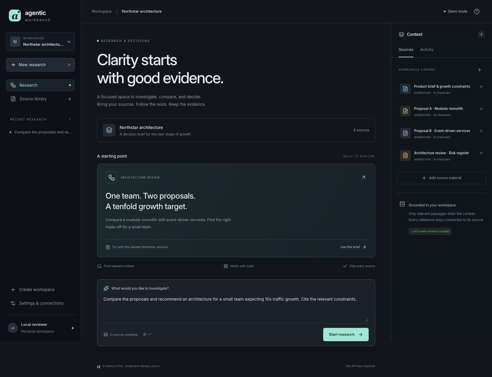
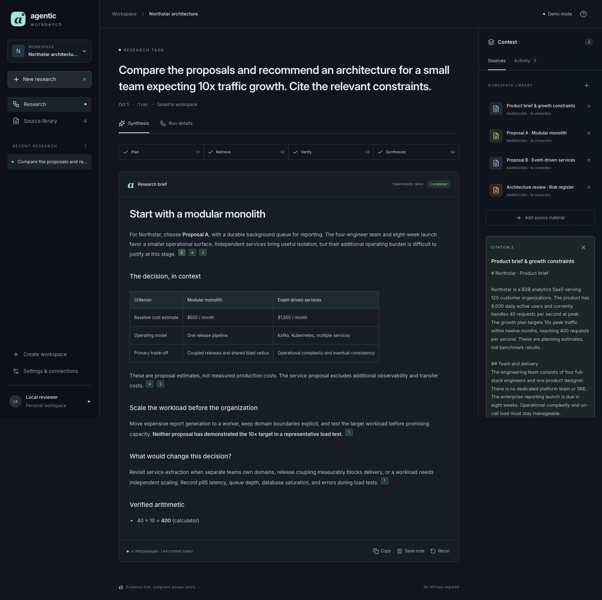
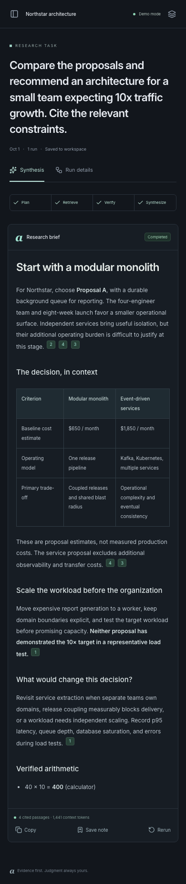
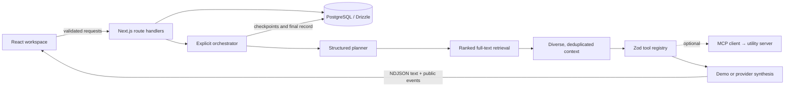

# Agentic Workbench

**An AI-powered research workspace built with Next.js and TypeScript.**

Turn a collection of documents into a cited decision brief. Follow a bounded agent workflow through planning, retrieval, tool execution, and streaming synthesis. Inspect the evidence and execution record afterwards.

Explicit orchestration · typed tool calling · PostgreSQL retrieval · optional MCP · no paid API required



## What you can do

- Create workspaces and import notes, Markdown, plain text, and text-based PDFs.
- Investigate a question with relevant passages selected within a context budget.
- Watch the answer stream alongside public activity summaries, tool calls, and timings.
- Open citations to the exact source excerpts selected for a run.
- Cancel, retry, inspect older attempts, copy results, and save a brief as a source note.
- Switch between a deterministic local demo and a real OpenAI-compatible provider.
- Cross-check calculations through an optional Streamable HTTP MCP server.

This is a **local, single-user portfolio application**, not an authenticated hosted service. It binds to loopback and rejects non-local Host headers. Do not remove that boundary to expose it publicly without adding authentication and tenant authorization. The source repository is public; your documents are not.

## Run locally

Prerequisites: Node.js 24+, pnpm 11.22.0, and Docker with Compose. Use a compatible pnpm installation or `corepack enable` if your Node distribution includes Corepack.

```sh
git clone https://github.com/kostrubin/agentic-workbench.git
cd agentic-workbench
cp .env.example .env
pnpm install --frozen-lockfile
docker compose up -d --wait
pnpm db:migrate
pnpm db:seed
pnpm dev
```

Open [localhost:3000](http://localhost:3000). PostgreSQL listens only on `127.0.0.1:54329`; its named Docker volume preserves your data. Migrations and seeding are repeatable. `docker compose down` stops the database without removing its volume.

For a production build:

```sh
pnpm build
pnpm start
```

## Try the demo

`AI_MODE=demo` is the default. No AI key, embedding service, web search subscription, or MCP server is needed.

The seeded **Northstar architecture** workspace contains four documents: a product brief, two competing proposals, and an architecture risk register. Start the prefilled task:

> Compare the proposals and recommend an architecture for a small team expecting 10x traffic growth. Cite the relevant constraints.

The run searches PostgreSQL, selects passages, compares constraints, calculates the growth target, and streams a cited brief. Open a citation, switch to **Run details**, and revisit the task from the sidebar. Try **Save note**, or add your own document.

**What is simulated:** demo planning is rule-based; the Northstar recommendation is a fixed, source-conditioned narrative. Other questions produce extractive source briefs, not open-ended LLM analysis. Streaming is deliberately paced. Retrieval, tools, ingestion, citations, persistence, errors, and cancellation are real. Demo mode tests application behavior, not model intelligence.



<details>
<summary>Mobile research view</summary>

</details>

## Architecture



**Execution:** task → validated plan → ranked retrieval → selected sections → comparison/calculation → synthesis → citation validation → terminal run record.

There is no autonomous shell, unrestricted web fetch, unbounded agent loop, or hidden reasoning transcript. The plan chooses a query and bounded tool options. The orchestrator owns execution order, cancellation, limits, and persistence. Public events describe actions, never private chain-of-thought.

See [architecture](docs/architecture.md), [context engineering](docs/context-engineering.md), and the [decision records](docs/decisions/).

### Stack

| Layer       | Choice                                                                      |
| ----------- | --------------------------------------------------------------------------- |
| Application | Next.js 16 App Router, React 19, strict TypeScript 6                        |
| UI          | Domain-focused components, authored CSS tokens, Lucide icons, safe Markdown |
| Persistence | PostgreSQL 17, Drizzle ORM, versioned transactional SQL migrations          |
| AI          | AI SDK 7, OpenAI-compatible adapter, Zod structured plans                   |
| Retrieval   | PostgreSQL English full-text search with a GIN index                        |
| Protocol    | Official MCP TypeScript SDK 1.x, Streamable HTTP                            |
| Testing     | Vitest, React Testing Library, Playwright, axe-core                         |
| Quality     | ESLint 9, Prettier, pnpm lockfile, GitHub Actions                           |

Authored CSS keeps the small component system easy to audit; a utility framework would not improve this particular surface. TypeScript 6 and ESLint 9 are intentional compatibility pins: the installed TypeScript ESLint parser rejects TS 7, and Next's React lint plugins do not yet support ESLint 10. Revisit together, rather than suppressing errors. Exact versions are in the lockfile.

## Real AI mode

Edit `.env` and restart the application:

```dotenv
AI_MODE=provider
AI_PROVIDER=openai-compatible
AI_BASE_URL=https://api.openai.com/v1
AI_MODEL=gpt-4.1-mini
AI_API_KEY=your-local-key
```

The selected endpoint/model must support OpenAI-style Chat Completions, JSON-schema structured output, and streaming. The model name above is an example; configure one available to your account. Keys never enter browser props or source control. The UI displays configuration status, not editable credentials.

Planning and synthesis are separate provider calls. Planning produces a validated tool plan; the application executes the tools, then gives bounded evidence and results to the streaming synthesizer. Eligible SDK requests have up to two retries. Failed or interrupted streams remain inspectable and can be rerun explicitly. Input/output usage aggregates both calls when reported.

Provider protocol behavior is tested against a local HTTP fixture. No paid provider request is made by the test suite. **A live hosted-provider smoke test requires your credentials and has not been performed.**

## MCP

```sh
# Separate terminal
pnpm mcp
```

Then set `MCP_URL=http://127.0.0.1:4318/mcp` in `.env` and restart the web app. A research task involving arithmetic now includes **Cross-check via MCP** in its activity timeline.

The optional adapter connects with the official SDK, discovers tools using `listTools`, checks the calculator's input shape, and maps only that known capability into the registry's typed arithmetic contract. It validates arguments and structured output locally. Arbitrary discovered tools cannot execute. Remote origins are rejected; the sample server listens on loopback and uses the SDK's Host validation.

A timeout or disconnected MCP server is recorded as an optional tool failure; native research continues. With `MCP_URL` unset, there is no dependency on MCP. The sample server is stateless and does not need database access. See [MCP design](docs/mcp.md).

## Retrieval and context

Ingestion normalizes text, preserves paragraphs where possible, splits oversized paragraphs at word boundaries, and stores chunks with document IDs and ordinal positions. A content hash makes repeat imports idempotent.

Retrieval OR-combines sanitized query terms, uses PostgreSQL `ts_rank_cd`, and fetches up to 40 candidate passages from the authorized workspace. The context builder sorts by relevance, selects one passage per source before extras, deduplicates normalized text, and fits at most eight passages into a **2,400 estimated-token evidence budget**. Estimates use three characters per token plus metadata allowance. This is not an exact model tokenizer.

Each citation stores an immutable excerpt on the run. Validation rejects unknown labels and uncited output when evidence was supplied. It **does not prove that a cited passage entails a claim**. English lexical matching can miss paraphrases and non-English text; embeddings are deliberately absent until measured retrieval failures justify them.

## Commands and validation

```sh
pnpm lint
pnpm typecheck
pnpm test                 # domain + component tests; no DB needed
pnpm eval                 # deterministic fixture evaluations; no DB needed
pnpm test:integration     # real PostgreSQL + local provider/MCP HTTP fixtures
pnpm build
pnpm exec playwright install chromium
pnpm test:e2e             # starts production server on port 3100
pnpm format:check
```

Integration tests create and clean up their own workspaces. Browser tests use the seed corpus and create additional test workspaces/runs; run them against a disposable local/CI database if you want a clean personal history. Browser tests enable a **server-gated test fault flag** only in their own web-server process. Normal development leaves it off.

The browser suite covers desktop and mobile research, streaming, source inspection, history, note ingestion, PDF extraction, saving results, cancellation, and failure/retry. axe-core checks the research screen. Tests also validate actual retrieval isolation, concurrent-run exclusion, bad tool inputs, forged citations, body limits, and local request boundaries. [Evaluation scope](docs/evaluation.md) explains what these checks establish.

CI runs lint, formatting, typecheck, unit tests, evaluations, database integration tests, production build, and Chromium E2E. Failing browser traces are uploaded for inspection. [Validation record](docs/validation.md) records the local evidence.

## Repository map

```text
src/app/                  Server-rendered bootstrap and HTTP routes
src/features/workbench/   UI, source viewer, run inspector, streaming controller
src/lib/                  Shared domain contracts and request boundary
src/server/ai/            Provider interface, versioned prompts, orchestrator
src/server/retrieval/     Normalization, chunking, context selection, citations
src/server/tools/         Zod registry, safe calculator, MCP adapter
src/server/db/            Drizzle schema, connection, repository
packages/mcp-server/      Optional Streamable HTTP utility server
migrations/               Transactional, versioned PostgreSQL DDL
scripts/                  Migrate, seed, deterministic evaluations
tests/                    Unit, component, database, provider and MCP tests
e2e/                      Desktop/mobile Playwright flows and upload checks
docs/                     Architecture, ADRs, evidence, screenshots
```

## Security and operational limits

- One local identity; workspace ownership checks are centralized. This is not multi-user auth.
- Same-origin writes, loopback Host validation on reads and writes, parameterized SQL, Zod boundaries, and a process-local write rate limiter.
- File allowlist, actual-body size limits, 2 MB uploads, 100 PDF pages, and 150,000 extracted characters. PDF parsing is lazy-loaded. Scans require external OCR. PDF ingestion should move to an isolated resource-limited worker before accepting hostile public uploads.
- Source text is untrusted data. Prompts delimit evidence; tool choices are schema-constrained. Prompt injection cannot grant shell access or trigger model-controlled writes, but can still influence generated prose.
- Safe Markdown: raw HTML is not executed; external links are rendered as text; citations are local buttons. No remote image rendering is intended.
- 90-second run deadline, bounded output, tool timeouts, sanitized public failures. Abandoned runs become failed after two minutes on the next workspace read.
- Runs are request-bound, not durable background jobs. Closing the connection cancels execution; there is no stream resumption. Partial answers are labeled unverified.
- Structured logs contain IDs, statuses, and timing, not prompts, source contents, or raw provider errors.
- Baseline CSP permits Next's inline runtime scripts and development evaluation. A hosted deployment needs nonce-based CSP, real authentication, quotas, and a shared rate limiter.

## Decisions, limitations, and next steps

The project favors a coherent vertical slice: explicit phases over an agent framework; one relational database over a separate vector service; a shared orchestration path for demo and real providers; native tools with MCP as an optional boundary. Results and citation snapshots are stored on run records rather than inventing a chat-message domain.

Current limits: latest 50 tasks in the sidebar; no task pagination, document editing/deletion, OCR, web search, semantic retrieval, collaborative editing, or provider picker in the browser. Source text and run history are loaded for the selected workspace, so this is intended for small research collections. No hosted performance or load-testing claim is made.

Recommended next increments:

1. Authenticated deployment, tenant-scoped authorization, storage quotas, and isolated PDF processing.
2. Durable jobs and resumable event delivery for long-running research.
3. Evidence-entailment evaluation with labeled questions; add hybrid retrieval only when it improves measured recall.
4. Lazy source loading, paginated history, source versioning, and authenticated MCP connections.
5. A credential-backed provider smoke suite with explicit cost limits.

See [engineering handoff and interview guide](docs/handoff.md). MIT licensed.
